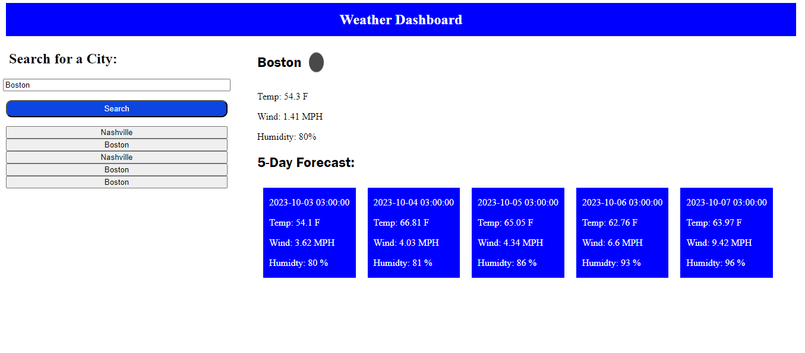

# weather-dashboard

## Description

The weather dashboard allows the user to search by any city, once the search button is hit, the user will be presented with the current days forecast as well as a five day forecast. Every city searched will be placed in local storage and will display under the search bar once the page is refreshed.

The goal of this project is to:

- Create a dynamic webpage displaying the current weather
- Use a weather API to find weather from the inputted city
- Display the search results from local storage to the webpage
- Using the API, display a five day forecast showing temperature, wind, and humidty

The motivation is to create a functional weather dashboard that will give an overall picture of the weather in the user's input city. 

## Installation

To use project locally, follow these steps:

1. Clone repository to local machine 
    - git clone https://github.com/brandonlambrecht/weather-dashboard

2. Open 'index.html' in your web browser 

3. Click on input text area and enter a city.

4. Once the search button is hit, the searched cities current weather and five day forecast will display

## Usage

1. See below for snap shot of work day scheduler 
Image

2. Follow deployed link for full access to
[Weather Dashboard](https://brandonlambrecht.github.io/weather-dashboard/)